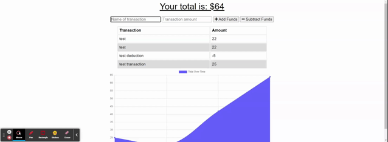

# budget-tracker

# Budget Tracker
An online/offline budget tracking PWA utilizing MongoDB & IndexedDB

## Table of Contents
- [Description](#description)
- [Installation](#installation)
- [Usage](#usage)
- [License](#license)
- [Contributors](#contributors)
- [Questions](#questions)

## Description
This is a full-stack application to track deposits and withdrawals, complete with offline functionality

The deployed application can be located at: https://cbm-budget-tracker.herokuapp.com/  

### Features
* Progressive Web App utilizing MongoDB and IndexedDB
    * Can be used through the browser or installed as a standalone app
* IndexedDB provides functionality with no internet connection 
    * New transactions will be added to the online DB when internet connection is restored

### Screenshot:   

## Installation Instructions
To install this application, please follow the below instructions:  
1.  Clone or download .zip file from Github to your local computer
2.  In Git Bash or Terminal, type `npm install` to install the necessary modules
3.  Update the information in `.env.EXAMPLE` with your username (root is default) and password and rename the file as `.env`
4.  When ready, type `npm start` in your terminal to launch `server.js`
5.  Navigate to `localhost:3000` or, if a different port is specified in your `.env` file, use that port

## Usage
Use this to keep track of deposits and withdrawals, even without internet connectivity. Use through your browser or install as a standalone app. 

## License 
This project is licensed under the MIT License. Click the link below to learn more about how you can use this project.  
License: [MIT License](https://opensource.org/licenses/MIT)

## Contributors
Many thanks to those that contributed to this project:
* Andrew Hardemon
* And last, but not least - *Grogu*  

## Questions
### Questions or issues?  
Questions or issues should be raised either by emailing the developer at the links below or creating an Issue within Github using the Issues button at the top of the repository
### To contact me:
* Github: [cbmartinez42](https://github.com/cbmartinez42)  
* Email: [cbmartinez42@gmail.com](mailto:cbmartinez42@gmail.com)